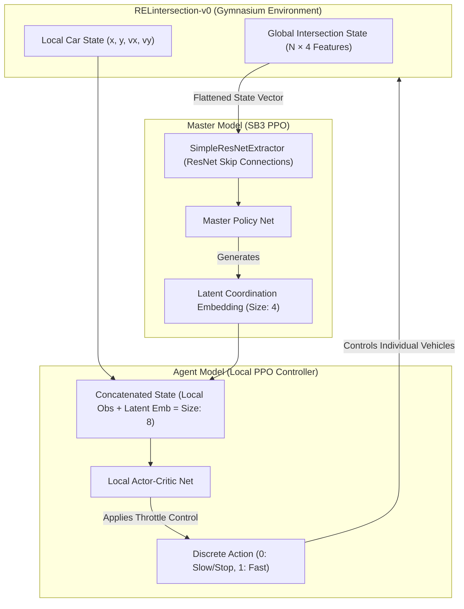

# Multi-Agent Autonomous Intersection Control via Latent Master Embeddings

[](https://www.python.org/)
[](https://github.com/openai/gym)
[](https://github.com/DLR-RM/stable-baselines3)
[](https://pytorch.org/)

A state-of-the-art cooperative Multi-Agent Reinforcement Learning (MARL) framework designed for autonomous intersection coordination. The architecture addresses the challenge of exponential action-space growth in multi-vehicle coordination by utilizing a **Dual-Loop Latent Master model**. 

In this system, a centralized **Master Model** observes the overall environment and projects global coordination guidelines into a low-dimensional continuous **latent embedding**. Local vehicle controllers (**Agent PPOs**) receive their individual state augmented with this master embedding to perform collision-free, high-throughput cooperative navigation.

---

## 🚀 Key Features

* **Scalable Dual-Loop Coordination**: Master embedding acts as a coordination protocol, eliminating action-space dimensionality explosion when scaling the number of controlled cars.
* **Deep ResNet Feature Extraction**: The `MasterModel` uses a custom `SimpleResNetExtractor` implementing residual skip connections to preserve gradient flow and model high-fidelity vehicle states.
* **Custom Highway-Env Layout**: Leverages a highly customized, 4-way intersection layout (`RELintersection-v0`) and a multi-agent control patch.
* **Complex Multi-Scenario Rotation**: Automatically generates up to 100 scenario permutations (25 base vehicle distributions × 4 clockwise rotations) to enhance agent generalization.
* **Cooperative Reward Engineering**: Combined rewards balancing collision penalties, speed limits, vehicle starvation prevention, and destination arrival bonuses.
* **Production-Ready Visualizations**: Exposes automated Matplotlib plotting utilities mapping Episode Rewards, Master Value Loss, Agent Value Loss, and training progress.

---

## 📊 System Architecture

### 1. Dual-Loop Latent Action Flow
The diagram below illustrates how global environment observations are compressed by the Master Model into coordinate-latent vectors, which are then fused with local car observations to guide individual vehicle decisions.



### 2. Training Iteration Cycle
The sequence below outlines the step-by-step state propagation and alternate optimization cycle during training.

```mermaid
sequenceDiagram
    autonumber
    participant Env as RELintersection-v0
    participant MM as MasterModel (SB3 PPO)
    participant AM as AgentModel (Local PPO)
    participant Loop as training_loop (training_handler.py)

    Note over Loop: Starts Training Cycle
    Loop->>Env: Reset environment & retrieve initial state
    Env-->>Loop: Initial Global State
    Loop->>MM: Prepare global state & forward
    MM-->>Loop: Latent Coordination Embedding (Size: 4)
    
    Note over Loop: For each controlled car: concat local state with Master Embedding
    Loop->>AM: Predict action (Slow / Fast throttle control)
    AM-->>Loop: Multi-Agent Actions (Throttle controls)
    
    Loop->>Env: Step environment with action tuple
    Env-->>Loop: Next State, Reward, Terminated, Truncated, Info
    
    Note over Loop: Store step experience in RolloutBuffer & update weights alternately
```

---

## 📂 Codebase Directory Structure

```text
RL/
├── highwayenv/                 # Custom highway-env wrappers and configurations
│   ├── CustomControlledVehicle.py # Custom kinematic vehicle properties
│   ├── custom_action.py        # Custom action spaces and discrete action factories
│   ├── intersection_class.py   # Core RELintersection-v0 Gymnasium environment
│   └── utils.py                # Environment patching and registration utilities
├── logger/                     # Logging settings and logger tokens
│   ├── neptune_logger.py       # Custom Neptune metadata tracker integration
│   └── token.json              # Neptune API Access Token (User configured)
├── src/                        # Core codebase logic
│   ├── experiment/             # Simulation scenarios & environment configs
│   │   ├── experiment_config.py# Central hyperparameter and experiment class configuration
│   │   ├── scenarios.py        # Base lane layout and vehicle coordinates
│   │   └── scenarios_config.py # Complex multi-agent intersection scenarios
│   ├── model/                  # Neural network models
│   │   ├── agent_handler.py    # Local vehicle controller and Driver env wrapper
│   │   ├── master_model.py     # Master model with SimpleResNetExtractor
│   │   └── model_handler.py    # Model wrappers (PPO, DQN, A2C)
│   ├── plotting_utils/         # Data plotting and graphics tools
│   │   └── plotting_utils.py   # Training summary, loss curves, and reward plotting
│   └── training/               # Training loop orchestrators and buffers
│       ├── episode_utils.py    # Per-episode transitions and step execution
│       ├── general_utils.py    # Model initialization and logger setup
│       ├── training_handler.py # Orchestrates run modes (Training vs Inference)
│       └── training_loop_utils.py # Cycles and buffers optimization routines
├── legacy_scripts/             # Legacy single-agent and comparison runners
│   ├── compare_algorithms.py   # Legacy sequential comparison script
│   └── main.py                 # Legacy training / evaluation script with rendering
├── analyze_results.ipynb       # Jupyter Notebook for result analysis & plotting (Stage 2)
├── prepare.py                  # Environment patches and validation helper (Immutable)
├── run_parallel_experiment.py  # Parallel multi-seed experiment runner (Stage 1)
├── train.py                    # Primary training / hyperparameter tuning script (Mutable)
├── program.md                  # AutoResearch research manual and constraints
├── results.tsv                 # Saved performance summary history
├── requirements.txt            # System dependencies
└── README.md                   # Repository documentation
```

---

## ⚙️ Installation & Setup

### 1. Prerequisite Environments
Make sure you have **Python 3.10** or higher installed.

### 2. Clone and Install Dependencies
Navigate into the repository directory and configure the environment:

```bash
# Create virtual environment
python -m venv .venv

# Activate virtual environment
# On Windows PowerShell:
.venv\Scripts\Activate.ps1
# On Windows Command Prompt:
.venv\Scripts\activate.bat
# On Linux/macOS:
source .venv/bin/activate

# Install required packages
pip install -r requirements.txt
```

### 3. Logger Token Setup
To activate Neptune logging, create a `logger/token.json` file containing your Neptune API credentials:

```json
{
    "api_token": "YOUR_NEPTUNE_API_TOKEN_HERE"
}
```

> [!NOTE]
> If Neptune logging is disabled or commented out in your run configuration, the file must still contain valid JSON formatting to satisfy structural imports inside `experiment_config.py`.

---

## 🎮 How to Run

The framework provides two primary paths for training and evaluation.

### Option A: Complete Multi-Seed Algorithm Comparison (2-Stage Workflow)

This is the recommended workflow to run, evaluate, and compare all three cooperative MARL algorithms (`MAPS`, `VN-MA-DDPG`, `MA-GA-DDPG`) across multiple seeds.

#### 1. Stage 1: Run Parallel Experiments
Execute the parallel runner to train/evaluate the algorithms across all validation seeds (`42`, `100`, `2026`). It automatically skips already completed runs.
```bash
python run_parallel_experiment.py --episodes 900
```
- `--episodes`: Number of episodes per seed (default: `900`).
- `--seeds`: Comma-separated list of seeds (default: `42,100,2026`).
The results will be saved as JSON history files under `experiments/histories/`.

#### 2. Stage 2: Analyze Results & Generate Plots
Open the Jupyter Notebook:
```bash
jupyter notebook analyze_results.ipynb
```
Run all cells in `analyze_results.ipynb` to:
- Load the history JSON files.
- Compute average performance metrics (Success Rate, Collision Rate, Reward, and Steps) across seeds.
- Display a comprehensive comparison table.
- Display smoothed convergence plots inline and save the output chart to `plots/algorithm_comparison.png`.

---

### Option B: Individual Model Tuning (Mutable Sandbox)

To modify model architectures, reward shaping, or hyperparameters:
1. Make target adjustments inside [train.py](file:///c:/PycharmProjects/RL/train.py).
2. Run the single-model training and evaluation script:
   ```bash
   python train.py
   ```
This script will evaluate your changes against the validation seeds and record performance in `results.tsv`.

---

## 🛠️ Hyperparameter & Configuration Guide

You can find and modify all model configs inside [experiment_config.py](file:///c:/PycharmProjects/RL/src/experiment/experiment_config.py).

### General & Training Settings
| Configuration Parameter | Type | Default Value | Description |
| :--- | :--- | :--- | :--- |
| `CYCLES` | `int` | `3` | Number of training cycles to perform |
| `EPISODES_PER_CYCLE` | `int` | `300` | Episodes run per cycle |
| `EPISODE_AMOUNT_FOR_TRAIN` | `int` | `2` | Number of episodes collected before backpropagation |
| `ONLY_INFERENCE` | `bool` | `False` | Toggle to run ONLY evaluation inference |
| `RENDER_MODE` | `str` | `"rgb_array"` | Gymnasium rendering mode (`"human"` or `"rgb_array"`) |

### Model Architecture Parameters
| Configuration Parameter | Type | Default Value | Description |
| :--- | :--- | :--- | :--- |
| `MODEL_TYPE` | `str` | `"PPO"` | Core model type (`"PPO"`, `"DQN"`, `"A2C"`) |
| `LEARNING_RATE` | `float` | `0.005` | Learning rate for optimizers |
| `N_STEPS` | `int` | `64` | Experience steps collected per rollout buffer |
| `BATCH_SIZE` | `int` | `32` | Minibatch size for policy updates |
| `EMBEDDING_SIZE` | `int` | `4` | Dimension of the latent coordination Master embedding |

### Environment Reward Profiles
| Reward Variable | Default Value | Description |
| :--- | :--- | :--- |
| `REACHED_TARGET_REWARD` | `50` | Bonus rewarded when a vehicle successfully crosses the intersection |
| `COLLISION_REWARD` | `-300` | Penalty enforced when vehicles collide with other structures or cars |
| `STARVATION_REWARD` | `-5` | Penalty when speed falls below fixed throttle limit (keeps cars moving) |
| `HIGH_SPEED_REWARD` | `5` | Reward granted when speed exceeds throttle target without crashes |

---

## 📈 Visualizations & Plots

During training, the training handler automatically saves detailed performance plots in:
`experiments/{date}_{experiment_id}/plots/`

Generated plots include:
1. `episode_rewards.png`: Average episode rewards accumulated by agents.
2. `master_value_loss.png` / `master_total_loss.png`: Value function optimization graphs for the master.
3. `agent_value_loss.png` / `agent_total_loss.png`: Performance of local vehicle controllers.
4. `combined_losses.png`: Overlay of both models' losses showing training stability.

---

## 🤝 Project Credits & Core Classes

* **Master Model**: [master_model.py](file:///c:/PycharmProjects/RL/src/model/master_model.py)
* **Agent Handler**: [agent_handler.py](file:///c:/PycharmProjects/RL/src/model/agent_handler.py)
* **Custom Environment**: [intersection_class.py](file:///c:/PycharmProjects/RL/highwayenv/intersection_class.py)
* **Experiment Setup (Legacy)**: [main.py](file:///c:/PycharmProjects/RL/legacy_scripts/main.py)
