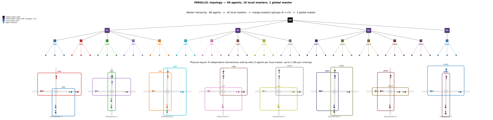
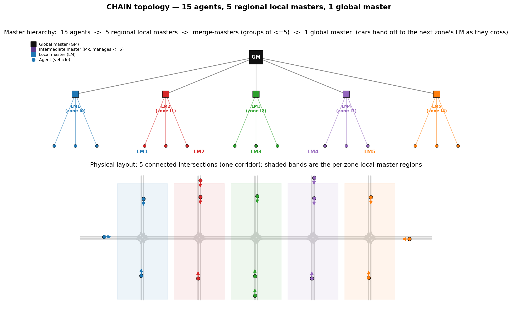

# Hierarchical Multi-Agent RL — Scalable Coordinated Driving

A 3-level master-agent hierarchy trained with PPO on custom `highway-env` layouts. The core claim: one shared model checkpoint, deployed at any scale from 3 to 48 agents across independent or connected intersections, consistently reduces crash rates compared to running agents without a master signal.

## Why it scales

Every node in the hierarchy — Global Master, Local Master, or Agent — uses the **same trained weights**. Roles differ only in how inputs are packed into the fixed-size observation vector, never in parameters. There is no per-scale retraining. When the system grows beyond 5 Local Masters, intermediate masters group them in sets of ≤5 recursively, forming a tree of depth ⌈log₅(N\_LMs)⌉ above the leaf LMs — all sharing the same master model.

## Architecture

```
                         GM  (Global Master)
                        / | \
                      M1  M2  ...   (intermediate masters when N_LMs > 5)
                     /|   |\
                   LM1  LM2  ...   (Local Masters — one per intersection zone)
                   /|\   /|\
                 a  a  a  a  a  a  (Agents — one per vehicle)
```

**Master observation (25-D):** 5 slots × 5 values each.
Each slot = `[v0, v1, v2, v3, type_bit]`:
- `v0..v3` is either a subordinate agent's 4-D kinematic state or a subordinate master's 4-D embedding.
- `type_bit = 0.0` marks a raw agent state slot; `type_bit = 1.0` marks a master embedding slot.

This identifier bit is what lets the same master model manage either agents or other masters without any architectural change. Empty slots are zero-padded.

**Master output:** a 4-D embedding vector, passed down to all subordinates.

**Agent observation (8-D):** 4-D local kinematic state + 4-D LM embedding received from the master above.

**Agent action:** binary — `{slow, fast}` — mapped to fixed throttle values.

## Topologies evaluated

**Parallel** — each intersection is an independent environment, managed by one Local Master. Agents never cross intersection boundaries. The hierarchy grows by adding more (LM, intersection) pairs.



**Chain** — intersections are physically connected in a road corridor. Agents route across multiple zones; the LM responsible for a zone receives and hands off agents dynamically as they enter or leave.



## Results

Evaluated on 30 scenarios per scale, two conditions:
- `normal` — full hierarchy active (GM → LMs → agents)
- `zero_master` — master signal zeroed out at every step; agents navigate on raw state alone

### Parallel scalability (crash rate per intersection, 30 scenarios)

| Agents | Local masters | normal | zero_master |
|---:|---:|---:|---:|
| 3 | 1 | 3% | 30% |
| 6 | 2 | 13% | 70% |
| 12 | 4 | 17% | 73% |
| 18 | 6 | 16% | 73% |
| 24 | 8 | 16% | 72% |
| 36 | 12 | 15% | 72% |
| 48 | 16 | 15% | 71% |

The crash rate gap stays at roughly 55–57 pp across all scales.

### Chain scalability (crash rate, 30 scenarios)

| Intersections | Agents | normal | zero_master |
|---:|---:|---:|---:|
| 2 | 6 | 7% | 80% |
| 3 | 9 | 20% | 67% |
| 4 | 12 | 33% | 97% |
| 5 | 15 | 30% | 77% |

Chain topology is harder — agents must cross zone boundaries, which creates multi-hop coordination conflicts. The master still provides a large benefit, though absolute crash rates are higher than parallel.

## Repository layout

```
.
├── highwayenv/                      # Custom gym environments
│   ├── intersection_class.py        # RELintersection-v0 (single 4-way crossing)
│   ├── double_intersection_class.py # RELdouble-intersection-v0
│   ├── roundabout_class.py          # RELroundabout-v0
│   ├── chain_intersection_class.py  # RELchain-intersection-v0 (connected corridor)
│   ├── CustomControlledVehicle.py
│   ├── custom_action.py
│   └── utils.py
│
├── src/
│   ├── model/
│   │   ├── master_model.py          # MasterModel: ResNet + SB3 PPO wrapper
│   │   ├── agent_handler.py         # Driver: per-vehicle gym.Env wrapper + SB3 PPO
│   │   └── model_handler.py         # save/load utilities
│   ├── training/
│   │   ├── training_handler.py      # training_loop(): outer cycle loop
│   │   ├── training_loop_utils.py   # PPO update, cycle prep, per-step helpers
│   │   ├── episode_utils.py         # process_episode(), master obs packing, identifier bit
│   │   ├── rollout_buffer_utils.py  # buffer reset/fill helpers
│   │   ├── episode_utils.py
│   │   └── general_utils.py         # model init, directory setup, logging
│   ├── experiment/
│   │   ├── experiment_config.py     # Experiment dataclass (all hyperparameters)
│   │   ├── scenarios.py             # Scenario pool generators
│   │   ├── scenarios_config.py      # Per-env scenario presets (exp7)
│   │   ├── scenario_geometry.py     # Intersection geometry helpers
│   │   └── experiment_config.py
│   ├── diagnostics/                 # Collision audit utilities
│   ├── plotting_utils/              # Training curve plotting
│   └── project_globals.py           # Global rollout buffers, step counter
│
├── scripts/
│   ├── training/
│   │   └── main_final.py            # Training entry point (W01 config, 1500 episodes)
│   ├── evaluation/
│   │   ├── run_full_evaluation.py   # Main evaluation script (parallel + chain)
│   │   ├── run_scalability_suite.py # Parallel scaling engine (imported by above)
│   │   ├── run_chain_scalability.py # Chain scaling engine (imported by above)
│   │   ├── run_proto_action_sweep.py# Core inference utilities (shared by all eval scripts)
│   │   └── run_mixed_layer_experiment.py  # Mixed-layer topology test
│   └── visualization/
│       └── visualize_hierarchy.py   # Generates the two figures in docs/figures/
│
├── tests/
│   └── test_scalability_regression.py  # Fast packing and layout invariant checks
│
├── models/
│   ├── agent/agent.pth              # Trained agent weights (checkpoint 6)
│   └── master/master.pth            # Trained master weights (checkpoint 6)
│
├── logger/                          # Optional Neptune experiment logger
├── docs/figures/                    # Hierarchy diagrams (parallel + chain)
├── setup.py
└── requirements.txt
```

## Training flow

```
main_final.py
  └─ training_loop()                          [training_handler.py]
       ├─ 4 cycles × 375 episodes = 1500 total
       │    Each episode:
       │      process_episode()               [episode_utils.py]
       │        for each env step:
       │          1. Each LM collects its agents' 4-D states
       │             → pack_lm_obs():  [agent_state | 0.0] × 5 slots  (identifier=0 → raw agent)
       │             → LM.predict()   → 4-D LM embedding
       │          2. GM collects all LM embeddings
       │             → pack_gm_obs():  [lm_emb | 1.0] × 5 slots       (identifier=1 → master)
       │             → GM.predict()   → 4-D GM embedding  (unused by agents in training; LM used)
       │          3. Each agent receives: [own_4D_state | lm_4D_embedding]
       │             → agent.predict() → action {slow=0, fast=1}
       │          4. env.step(actions) → next obs, rewards, done
       │          5. Store (obs, action, reward, value, log_prob) in rollout buffers
       │
       │    Every 3 episodes:
       │      perform_training_phase()         [training_loop_utils.py]
       │        → PPO update on master rollout buffer  (policy + value + entropy)
       │        → PPO update on agent rollout buffers  (policy + value + entropy)
       │        FULL_JOINT_TRAINING=True: both networks update every cycle
       │
       └─ save_models()                        [model_handler.py]
```

### Identifier bit in detail

The master observation is packed as 5 consecutive slots. A slot represents one subordinate, regardless of whether that subordinate is a raw vehicle or another master:

```
slot_i = [v0, v1, v2, v3, type_bit]
```

- When an LM packs its agents: `type_bit = 0.0`, `v0..v3 = agent kinematic state` (x, y, vx, vy — normalized)
- When the GM packs LM embeddings: `type_bit = 1.0`, `v0..v3 = LM's 4-D output embedding`
- When an intermediate master packs sub-master embeddings: same as GM — `type_bit = 1.0`

The network sees the bit as part of the input vector. Because the same weights process both cases, a master trained on one topology generalizes to others at inference time without retraining.

## Hyperparameters

| Parameter | Value | Notes |
|---|---|---|
| Total episodes | 1500 | 4 cycles × 375 |
| Episodes per PPO update | 3 | `EPISODE_AMOUNT_FOR_TRAIN` |
| PPO epochs per update | 5 | `N_PPO_EPOCHS` |
| Agent learning rate | 3e-3 | |
| Master learning rate | 3e-4 | |
| Clip range | 0.2 | |
| Entropy coefficient | 0.05 | |
| Discount (γ) | 0.90 | |
| GAE λ | 0.90 | |
| Value coefficient | 1.0 | |
| Agent network arch | wide | `[256, 256]` |
| Master network arch | ResNet | 25→128, 2× residual block, 128→128→4 |
| Master obs dim | 25 | 5 slots × (4D + 1 bit) |
| Master embedding dim | 4 | |
| Agent obs dim | 8 | 4D state + 4D LM embedding |
| Collision reward | -50 | |
| Arrival reward | +50 | |
| High-speed reward | +5/step | |
| Starvation reward | 0 | (disabled in W01) |
| Training mode | FULL\_JOINT | master + agents update every cycle |
| Rollout buffer size | 384 | `N_STEPS` |

## Setup

```bash
pip install -e .
pip install -r requirements.txt
```

Requires Python 3.10+.

## Training

```bash
python scripts/training/main_final.py
```

Checkpoints are saved under `experiment_runs/final_<timestamp>/trained_model/`.

## Evaluation

```bash
python scripts/evaluation/run_full_evaluation.py
```

Runs both parallel and chain scalability and writes results to `EVALUATION_RESULTS/<timestamp>/`. Use `--smoke` for a quick end-to-end sanity check. Use `--agent` and `--master` to point at a different checkpoint pair.

Mixed-layer topology experiment (a master managing both sub-masters and raw agents on the same level):

```bash
python scripts/evaluation/run_mixed_layer_experiment.py
```

Regenerate the hierarchy diagrams:

```bash
python scripts/visualization/visualize_hierarchy.py
```

## Tests

```bash
python -m pytest tests/
```
